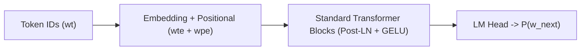
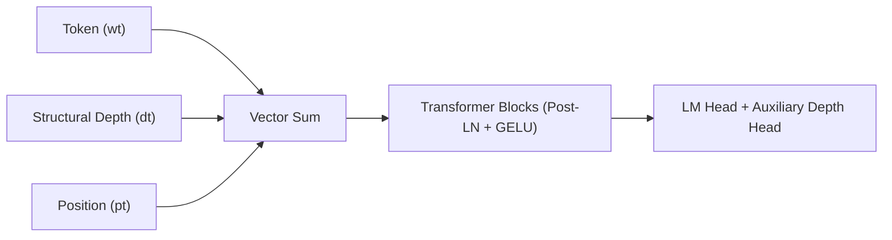
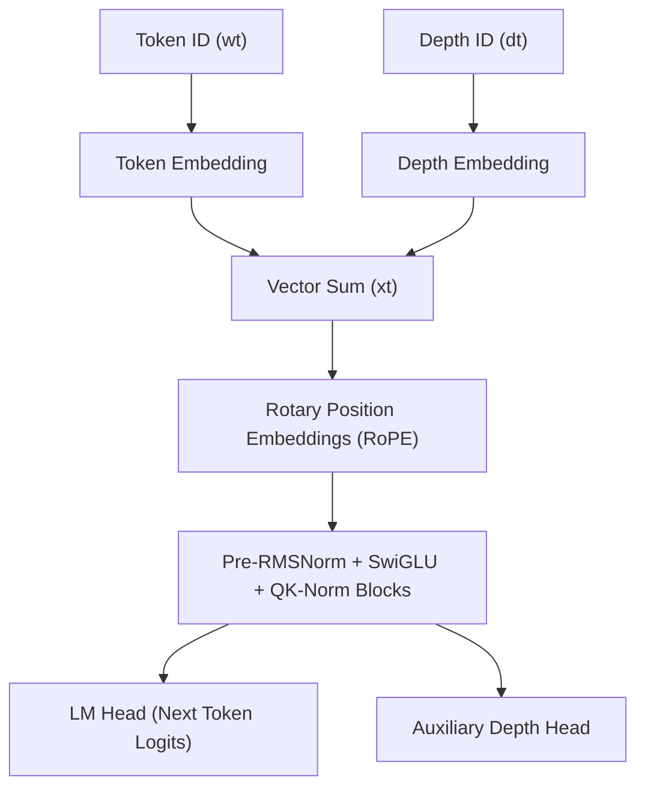

# 📐 APL SLM Architecture Evolution & Version Guide

This document provides a comprehensive technical reference for the three architectural generations of **APL SLM** (`v1`, `v2`, and `v3`), detailing their motivation, representations, neural components, training objectives, and capabilities.

---

## 📊 High-Level Comparison Matrix

| Feature | **v1 (Baseline)** | **v2 (Depth Conditioned)** | **v3 (Modern RoPE + SwiGLU)** |
| :--- | :--- | :--- | :--- |
| **Paradigm** | Pure Autoregressive Sequence Modeling | Structural Syntax Conditioning | High-Performance Modern Transformer |
| **Tokenizer** | Character / Unicode APL Glyphs (~170 tokens) | Character / Unicode APL Glyphs (~170 tokens) | Character / Unicode APL Glyphs (~170 tokens) |
| **Input Channels** | Token ($w_t$) | Token ($w_t$) + Structural Depth ($d_t$) | Token ($w_t$) + Structural Depth ($d_t$) |
| **Positional Encoding** | Absolute Learned Embeddings (`wpe`) | Absolute Learned Embeddings (`wpe`) | Rotary Position Embeddings (**RoPE**) |
| **Layer Normalization** | Standard `LayerNorm` (Post-LN) | Standard `LayerNorm` (Post-LN) | Pre-normalization **RMSNorm** |
| **FFN Activation** | GELU | GELU | **SwiGLU** (Gated Linear Unit) |
| **Attention Stability** | Standard Scaled Dot-Product | Standard Scaled Dot-Product | **QK-Norm** + Scaled Dot-Product |
| **KV Caching** | Multi-token autoregressive cache | Multi-token autoregressive cache | Single-token $\mathcal{O}(1)$ step KV cache |
| **Auxiliary Heads** | None | Auxiliary Depth Head ($P(d_{t+1})$) | Auxiliary Depth Head ($P(d_{t+1})$) |
| **Primary Capability** | Fast causal syntax baseline | Balanced parentheses, brackets & dfns | High-capacity reasoning, fast inference & syntax precision |

---

## 🏛️ Version Deep Dives

### ⚡ Version 1: Baseline Causal Transformer
* **Directory**: `src/v1/` (`model_v1.py`, `train_v1.py`, `autocomplete_v1.py`)
* **Concept**: Standard autoregressive causal language model predicting $P(w_t \mid w_{<t})$.

#### Key Characteristics:
- Treats APL code purely as a linear sequence of Unicode tokens and ASCII characters.
- Fast baseline without domain-specific execution or structural conditioning.
- Susceptible to unclosed parentheses `(...)`, unmatched array index brackets `[...]`, or unclosed dfns `{...}` across long sequences.

---

### 🔄 Version 2: Structural Depth Conditioned Transformer
* **Directory**: `src/v2/` (`model_v2.py`, `train_v2.py`, `autocomplete_v2.py`)
* **Concept**: Tracks nesting depth of parentheses `()`, brackets `[]`, and dfns `{}` ($d_t \in [0, 31]$) and injects it directly into the embedding layer.

$$\mathbf{x}_t = \mathbf{e}_{\text{token}}(w_t) + \mathbf{e}_{\text{depth}}(d_t) + \mathbf{e}_{\text{pos}}(t)$$

#### Key Improvements:
- **Zero Unmatched Bracket/Paren/Dfn Bugs**: Injects structural depth embedding and trains with auxiliary depth prediction loss.
- **Dynamic Syntax-Balanced Stopping**: Automatically finishes completion as soon as depth returns to 0 and a statement delimiter/newline is encountered.
- **Depth Loss Penalty Regularization**: Auxiliary depth prediction encourages structural syntax awareness.

---

### 🧠 Version 3: Modern High-Performance Transformer
* **Directory**: `src/v3/` (`model_v3.py`, `train_v3.py`, `autocomplete_v3.py`)
* **Concept**: State-of-the-art transformer backbone tailored for ultra-fast local CPU/GPU inference with Pre-RMSNorm, SwiGLU, RoPE, QK-Norm, and KV caching.

#### Key Improvements:
- **Pre-RMSNorm**: Faster and more numerically stable residual normalization.
- **SwiGLU Activation**: Gated feedforward activation $(\mathbf{x} \mathbf{W}_1 \odot \text{SiLU}(\mathbf{x} \mathbf{W}_{\text{gate}})) \mathbf{W}_2$.
- **Rotary Position Embeddings (RoPE)**: Direct relative sequence position encoding on Queries and Keys.
- **QK-Norm**: Query and Key normalization prior to attention dot-product to prevent attention entropy collapse.
- **Single-Token KV Caching**: Sub-millisecond $\mathcal{O}(1)$ step projection time during interactive autocompletion.

